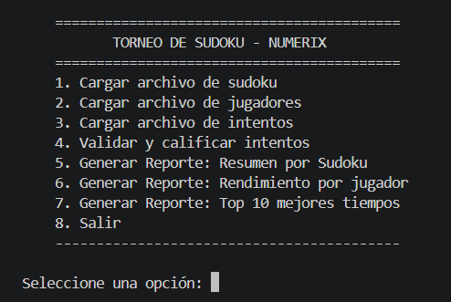
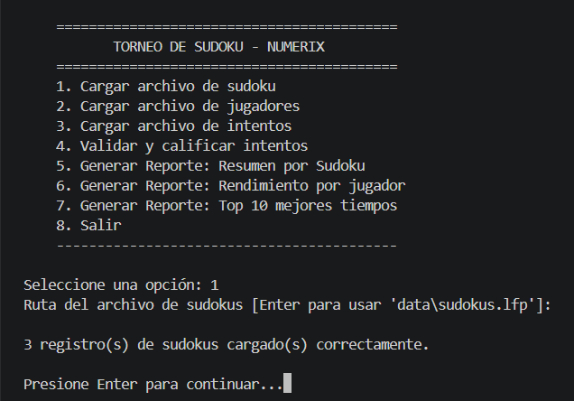
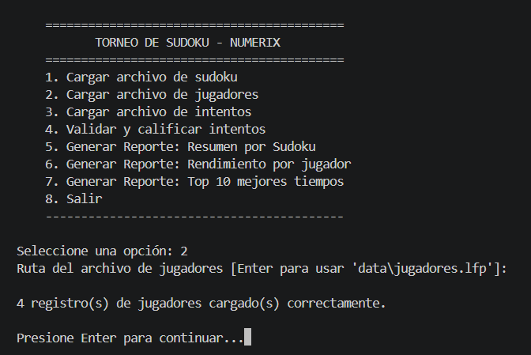
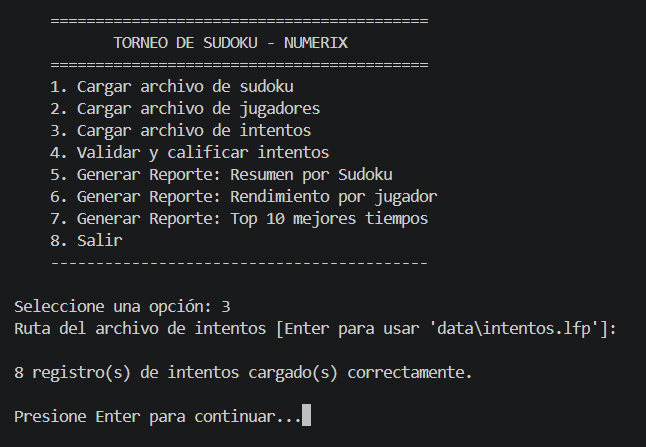
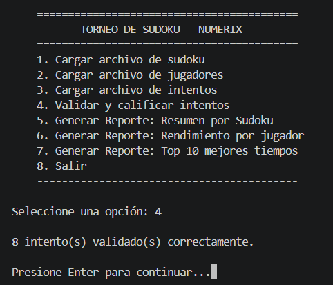
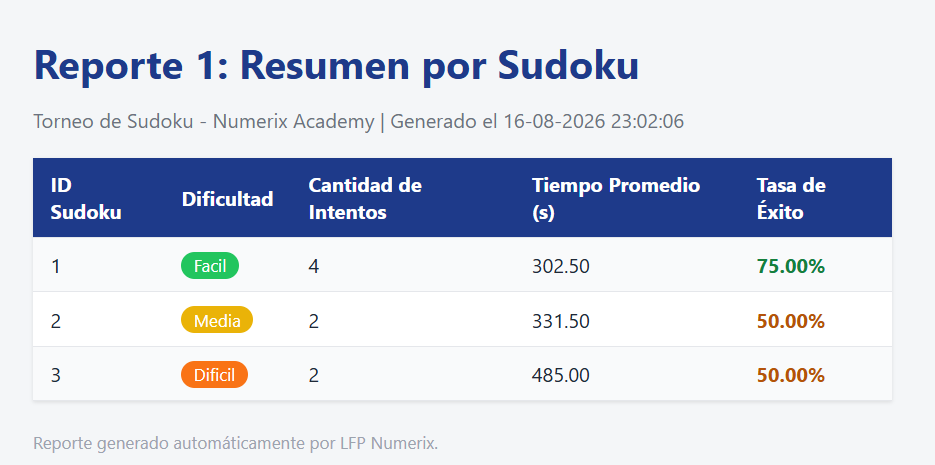
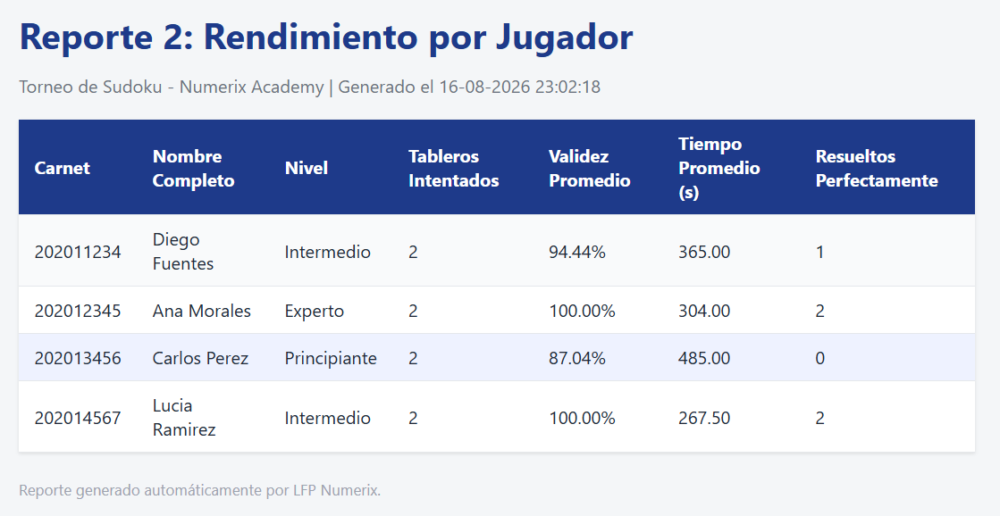
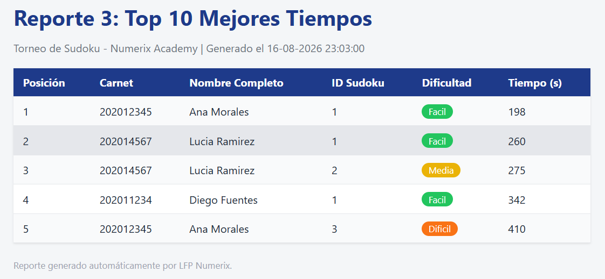

# Informe de Desarrollo — LFP Numerix
### Torneo de Sudoku: Validación y Análisis de Partidas

**Curso:** Lenguajes Formales y de Programación
**Universidad de San Carlos de Guatemala — Facultad de Ingeniería**
**Autor:** Oliver Jorge Raxtún Morales — Carné 202400634

---

## 1. Introducción

Este informe documenta el proceso de implementación de la práctica
**LFP Numerix**, los retos técnicos enfrentados —particularmente en la
validación matricial del Sudoku—, las soluciones aplicadas, y las
conclusiones obtenidas tras finalizar el desarrollo.

## 2. Resumen de lo implementado

Se desarrolló un sistema de consola en Python, aplicando Programación
Orientada a Objetos, capaz de:

- Leer tres archivos delimitados por comas (`.lfp`): tableros de
  Sudoku, jugadores e intentos de resolución.
- Reconstruir tableros y soluciones como matrices de 9x9 a partir de
  cadenas de 81 caracteres.
- Validar cada intento contra las reglas del Sudoku: respeto de pistas
  originales, y validez de las 9 filas, 9 columnas y 9 cajas de 3x3.
- Calcular métricas de desempeño: tiempo promedio, porcentaje de
  validez y tasa de éxito.
- Generar tres reportes analíticos en formato HTML.
- Ofrecer un menú interactivo en consola para todas las funciones
  anteriores.

El código se organizó en paquetes separados por responsabilidad
(`modelos`, `validacion`, `gestion`, `reportes`), siguiendo el diseño
descrito en el Manual Técnico.

## 3. Proceso de implementación

El desarrollo se dividió en las siguientes etapas:

1. **Modelado de clases.** Se definieron primero `Tablero`, `Jugador` e
   `Intento`, cada una responsable únicamente de representar sus datos
   y de construir su propia matriz 9x9 a partir de la cadena de 81
   caracteres.
2. **Lógica de validación.** Se aisló toda la lógica de validación en
   una clase independiente, `ValidadorSudoku`, para no mezclar reglas
   de negocio con la representación de los datos.
3. **Orquestación.** `GestorTorneo` se construyó como la clase que
   conecta la lectura de archivos con la validación y el cálculo de
   métricas, manteniendo el estado del torneo en memoria.
4. **Reportes.** Se implementó `GeneradorReportes` para transformar las
   listas de métricas ya calculadas en archivos HTML con una hoja de
   estilos común.
5. **Menú de consola.** Finalmente se construyó `main.py`, que conecta
   la entrada del usuario con los métodos de las clases anteriores.
6. **Pruebas.** Se generaron datos de ejemplo (`data/*.lfp`) que
   incluyen intentos perfectos, intentos con pistas modificadas e
   intentos con filas/celdas repetidas, para poder observar los
   distintos escenarios de calificación y confirmar que las métricas y
   los reportes se calculan correctamente.

## 4. Retos técnicos y soluciones aplicadas

### 4.1 Reconstrucción de la matriz a partir de una cadena plana

**Reto:** los archivos `.lfp` entregan el tablero como una cadena de 81
caracteres, no como una matriz. Era necesario convertir esa cadena en
una estructura de 9x9 de forma confiable, y validar que efectivamente
tuviera 81 caracteres numéricos antes de continuar.

**Solución:** se implementó un método `_construir_matriz` en las clases
`Tablero` e `Intento` que recorre la cadena en bloques de 9 caracteres
(`cadena[inicio:fin]`), calculando `inicio = fila * 9` para cada una de
las 9 filas. Se agregó una validación de longitud y de que todos los
caracteres sean dígitos, lanzando un `ValueError` descriptivo si no se
cumple, en lugar de fallar con un error genérico de índice fuera de
rango.

### 4.2 Validar filas, columnas y cajas con la misma lógica

**Reto:** las tres unidades de validación (fila, columna y caja) tienen
formas de extraerse distintas de la matriz, pero la regla que deben
cumplir es idéntica: contener los dígitos del 1 al 9 sin repetirse.
Duplicar la lógica de validación tres veces habría sido propenso a
errores e innecesario.

**Solución:** se separó el problema en dos partes independientes:
1. Tres métodos (`_obtener_filas`, `_obtener_columnas`, `_obtener_cajas`)
   cuya única responsabilidad es **extraer** listas de 9 valores de la
   matriz.
2. Un único método (`_es_grupo_valido`) que aplica la **misma regla**
   (`sorted(valores) == [1..9]`) sobre cualquier lista de 9 valores que
   reciba, sin importar si proviene de una fila, columna o caja.

Esto evitó triplicar la lógica de validación y redujo el riesgo de
inconsistencias entre las tres reglas.

### 4.3 Cálculo del índice de la caja de 3x3

**Reto:** a diferencia de filas y columnas, las cajas de 3x3 no
corresponden a un índice directo de la matriz; hay que agrupar celdas
que pertenecen a bloques de 3 filas por 3 columnas.

**Solución:** se recorrieron los índices de inicio de cada bloque con
pasos de 3 (`range(0, 9, 3)`), tanto para filas como para columnas, y
por cada combinación de `bloque_fila` y `bloque_columna` se construyó
la caja con una comprensión de listas anidada que recorre las 3 filas y
las 3 columnas del bloque correspondiente. Esto permitió obtener las 9
cajas sin necesidad de codificar manualmente sus posiciones una por
una.

### 4.4 Distinguir "pista inválida" de "regla de fila/columna/caja incumplida"

**Reto:** el enunciado exige dos verificaciones distintas que podían
confundirse: (a) que una celda originalmente fija no haya sido
modificada, y (b) que cada fila/columna/caja cumpla la regla de 1 a 9
sin repetir. Un intento podría tener el 100% de las filas, columnas y
cajas válidas y aun así haber modificado una pista original (por
ejemplo, cambiando un 5 fijo por un 1 y compensando en otra celda).

**Solución:** se calcularon ambas verificaciones de forma
**independiente** sobre el objeto `Intento`: `pistas_respetadas`
(booleano) y `porcentaje_validez` (numérico, basado en las 27
unidades). Un intento solo se marca como `resuelto_correctamente` si
ambas condiciones se cumplen simultáneamente, tal como lo especifica el
enunciado, en lugar de mezclar ambas verificaciones en un solo cálculo.

### 4.5 Manejo de archivos con líneas de formato incorrecto

**Reto:** un archivo `.lfp` real puede tener líneas vacías, líneas con
menos campos de los esperados, o cadenas de tablero/solución con una
longitud distinta a 81 caracteres. El sistema no debía detenerse por
completo ante un solo registro mal formado.

**Solución:** cada método de carga (`cargar_sudokus`,
`cargar_jugadores`, `cargar_intentos`) recorre el archivo línea por
línea dentro de un bloque `try/except`, acumulando los errores
encontrados en una lista en lugar de interrumpir la ejecución. Al
finalizar, se informa al usuario cuántos registros se cargaron
correctamente y el detalle de los errores, permitiendo así procesar el
resto del archivo aunque existan líneas inválidas.

## 5. Pruebas realizadas

Se construyó un conjunto de datos de ejemplo (`data/sudokus.lfp`,
`data/jugadores.lfp`, `data/intentos.lfp`) con 3 tableros, 4 jugadores y
8 intentos, diseñado deliberadamente para cubrir distintos escenarios:

| Escenario | Resultado esperado | Resultado obtenido |
|---|---|---|
| Solución idéntica a la solución real del tablero | `porcentaje_validez = 100%`, `resuelto_correctamente = True` | Correcto |
| Solución con una pista original modificada | `pistas_respetadas = False`, `resuelto_correctamente = False` | Correcto |
| Solución con una fila con un valor duplicado | `porcentaje_validez < 100%`, `resuelto_correctamente = False` | Correcto |
| Intento referenciando un `id_sudoku` inexistente | Se reporta como error y no se valida | Correcto |
| Archivo con ruta inexistente | Mensaje de error controlado, sin detener el programa | Correcto |

Con estos datos se ejecutó el flujo completo del menú (carga de los
tres archivos, validación, y generación de los tres reportes),
confirmando que las métricas mostradas en los reportes HTML coinciden
con los resultados calculados por `GestorTorneo`.

---

---

---

---

---

## 6. Alcance cumplido frente al enunciado

| Requerimiento del enunciado | Estado |
|---|---|
| Programación Orientada a Objetos (Tablero, Jugador, Intento) | Cumplido |
| Lectura de archivos con `open()`, `with`, `readlines()` | Cumplido |
| Separación de datos con `split(',')` | Cumplido |
| Representación de tableros como matrices (listas de listas) | Cumplido |
| Validación de filas, columnas y cajas de 3x3 | Cumplido |
| Cálculo de métricas de desempeño | Cumplido |
| Generación de 3 reportes en HTML | Cumplido |
| Menú funcional en consola | Cumplido |
| Manejo de excepciones (opcional) | Cumplido |
| Solucionador automático por backtracking (opcional) | No implementado |
| Gráficos estadísticos con librerías JavaScript (opcional) | No implementado |

Los dos puntos opcionales no implementados (solucionador automático y
gráficos JavaScript) se dejaron fuera del alcance por priorizar la
robustez y correcta cobertura de los requerimientos obligatorios dentro
del tiempo de desarrollo disponible.

## 7. Conclusiones

- Separar el proyecto en paquetes por responsabilidad (`modelos`,
  `validacion`, `gestion`, `reportes`) facilitó probar cada parte de
  forma aislada; en particular, poder probar `ValidadorSudoku` sin
  depender del menú de consola aceleró la detección de errores en la
  lógica de validación.
- El uso de una única función genérica para validar "grupos de 9
  valores" (`_es_grupo_valido`), reutilizada para filas, columnas y
  cajas, demostró ser más simple y menos propenso a errores que
  escribir tres validaciones distintas.
- Distinguir explícitamente entre "pistas respetadas" y "porcentaje de
  validez" fue clave para cumplir con precisión la definición de
  "resuelto correctamente" del enunciado, evitando calificar como
  correctos intentos que técnicamente cumplían las 27 unidades pero
  habían alterado una pista original.
- Acumular errores de carga por línea en lugar de detener el programa
  ante el primer archivo mal formado hizo que el sistema fuera más
  tolerante a datos reales, que rara vez son perfectos.
- Como trabajo futuro, se podría implementar el solucionador automático
  por backtracking (para verificar de forma independiente la dificultad
  real de un tablero) y agregar gráficos estadísticos en los reportes
  HTML mediante una librería JavaScript como Chart.js.

---

