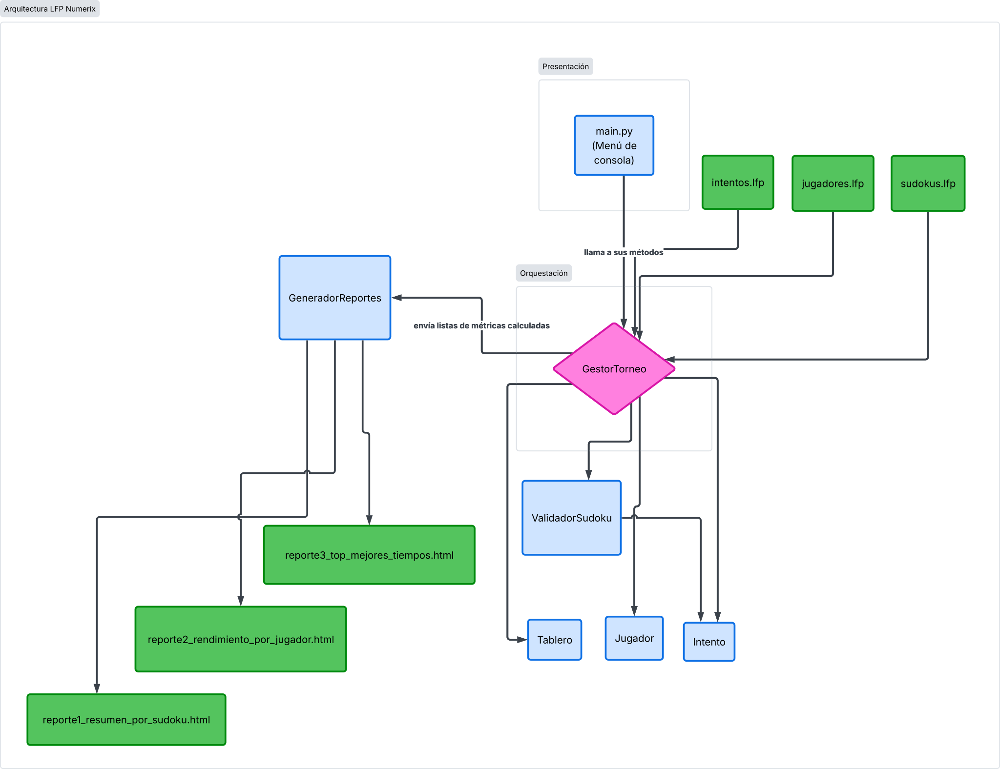
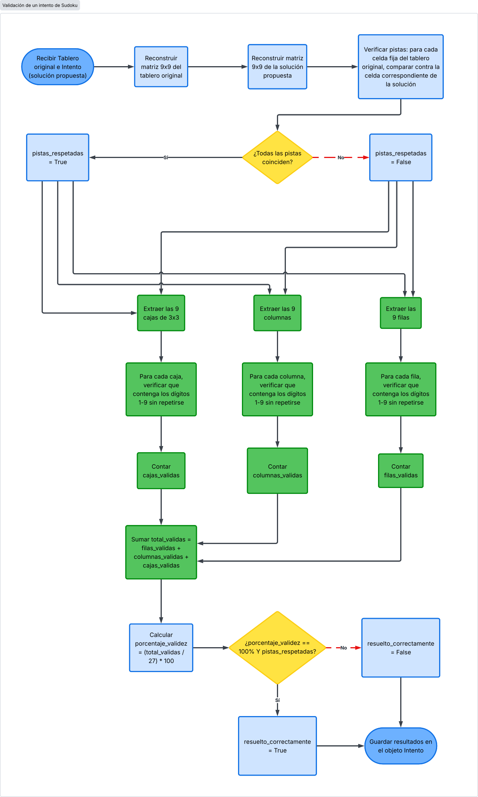

# Manual Técnico — LFP Numerix
### Torneo de Sudoku: Validación y Análisis de Partidas

**Curso:** Lenguajes Formales y de Programación
**Universidad de San Carlos de Guatemala — Facultad de Ingeniería**
**Autor:** Oliver Jorge Raxtún Morales — Carné 202400634

---

## 1. Introducción

Este documento describe la estructura técnica, las clases, la lógica de
validación matricial y los requerimientos del sistema **LFP Numerix**,
desarrollado en Python aplicando Programación Orientada a Objetos (POO)
para automatizar la calificación de intentos de resolución de Sudoku y
la generación de reportes analíticos de un torneo.

## 2. Requerimientos técnicos

| Requerimiento | Detalle |
|---|---|
| Lenguaje | Python 3.x |
| Librerías | Únicamente librerías estándar: `os`, `sys`, `datetime` |
| Paradigma | Programación Orientada a Objetos (POO) |
| Entrada de datos | Archivos de texto delimitados por comas (`.lfp`) |
| Salida | Reportes en formato HTML |
| Entorno de ejecución | Consola / terminal (PyCharm, VS Code, IDLE o equivalente) |

No se requieren dependencias externas (`pip install`); el proyecto se
ejecuta con una instalación estándar de Python 3.

## 3. Arquitectura y estructura del proyecto

El sistema está organizado en capas, separando modelos de datos, lógica
de validación, orquestación y generación de reportes:

```
Practica1/
├── main.py                          # Capa de presentación (menú de consola)
├── src/
│   ├── modelos/                     # Capa de datos (POO)
│   │   ├── tablero.py               # Clase Tablero
│   │   ├── jugador.py               # Clase Jugador
│   │   └── intento.py               # Clase Intento
│   ├── validacion/                  # Capa de lógica de negocio
│   │   └── validador_sudoku.py      # Clase ValidadorSudoku
│   ├── gestion/                     # Capa de orquestación
│   │   └── gestor_torneo.py         # Clase GestorTorneo
│   └── reportes/                    # Capa de presentación de salida
│       └── generador_reportes.py    # Clase GeneradorReportes
├── data/                            # Archivos .lfp de entrada
└── reportes/                        # Archivos .html de salida
```

Esta separación permite que cada clase tenga una única responsabilidad
(principio de responsabilidad única), facilita las pruebas y hace que el
programa sea más fácil de mantener y extender.



## 4. Descripción de clases y métodos

### 4.1 `Tablero` (`src/modelos/tablero.py`)

Representa un tablero de Sudoku del torneo.

| Atributo | Descripción |
|---|---|
| `id_sudoku` | Identificador único (entero) |
| `dificultad` | Facil, Media, Dificil o Experto |
| `cadena_original` | Cadena de 81 dígitos leída del archivo |
| `matriz` | Representación en lista de listas (9x9) |

| Método | Descripción |
|---|---|
| `_construir_matriz(cadena)` | Convierte la cadena de 81 caracteres en una matriz 9x9 |
| `es_celda_fija(fila, columna)` | Indica si una celda es una pista original (≠0) |
| `obtener_valor(fila, columna)` | Devuelve el valor de una celda |

### 4.2 `Jugador` (`src/modelos/jugador.py`)

Representa a un jugador inscrito en el torneo.

| Atributo | Descripción |
|---|---|
| `carnet` | Identificador único (entero) |
| `nombre`, `apellido` | Datos personales |
| `nivel` | Principiante, Intermedio o Experto |

| Método | Descripción |
|---|---|
| `nombre_completo()` | Devuelve `"nombre apellido"` |

### 4.3 `Intento` (`src/modelos/intento.py`)

Representa el intento de resolución de un jugador sobre un tablero, y
almacena el resultado de su validación.

| Atributo | Descripción |
|---|---|
| `carnet`, `id_sudoku` | Relacionan el intento con Jugador y Tablero |
| `solucion`, `matriz_solucion` | Cadena y matriz 9x9 de la solución propuesta |
| `tiempo_segundos`, `fecha` | Metadatos del intento |
| `filas_validas`, `columnas_validas`, `cajas_validas` | Conteo de unidades válidas (0–9 cada una) |
| `porcentaje_validez` | (unidades válidas / 27) × 100 |
| `pistas_respetadas` | `True` si ninguna pista original fue modificada |
| `resuelto_correctamente` | `True` si `porcentaje_validez == 100` y `pistas_respetadas` |

### 4.4 `ValidadorSudoku` (`src/validacion/validador_sudoku.py`)

Clase con métodos estáticos/de clase que contiene toda la lógica de
validación matricial. No mantiene estado propio; recibe un `Tablero` y
un `Intento` y actualiza los resultados directamente en el objeto
`Intento`.

| Método | Descripción |
|---|---|
| `_es_grupo_valido(valores)` | Verifica que una lista de 9 valores contenga los dígitos 1–9 sin repetirse |
| `_obtener_filas(matriz)` | Extrae las 9 filas de la matriz |
| `_obtener_columnas(matriz)` | Extrae las 9 columnas de la matriz |
| `_obtener_cajas(matriz)` | Extrae las 9 cajas de 3x3 de la matriz |
| `_verificar_pistas(tablero, intento)` | Compara las celdas fijas del tablero original contra la solución |
| `validar_intento(tablero, intento)` | Ejecuta la validación completa y actualiza el `Intento` |

### 4.5 `GestorTorneo` (`src/gestion/gestor_torneo.py`)

Clase orquestadora central. Mantiene los diccionarios de sudokus y
jugadores, la lista de intentos, y expone los métodos de carga,
validación y cálculo de métricas para los tres reportes.

| Método | Descripción |
|---|---|
| `cargar_sudokus(ruta)` | Lee `sudokus.lfp`, construye objetos `Tablero` |
| `cargar_jugadores(ruta)` | Lee `jugadores.lfp`, construye objetos `Jugador` |
| `cargar_intentos(ruta)` | Lee `intentos.lfp`, construye objetos `Intento` |
| `validar_intentos()` | Ejecuta `ValidadorSudoku.validar_intento` sobre cada intento |
| `calcular_resumen_por_sudoku()` | Métricas para el Reporte 1 |
| `calcular_rendimiento_por_jugador()` | Métricas para el Reporte 2 |
| `calcular_top_mejores_tiempos()` | Métricas para el Reporte 3 |

### 4.6 `GeneradorReportes` (`src/reportes/generador_reportes.py`)

Construye los tres archivos HTML a partir de las listas de métricas que
entrega `GestorTorneo`, aplicando una hoja de estilos común.

### 4.7 `main.py`

Contiene el menú interactivo de consola y las funciones que conectan la
entrada del usuario con los métodos de `GestorTorneo` y
`GeneradorReportes`.

## 5. Lógica de validación matricial

### 5.1 Reconstrucción de matrices

Tanto el tablero original como la solución propuesta llegan como
cadenas de 81 caracteres. Se reconstruyen como matrices de 9x9 mediante
un recorrido fila por fila:

```
para fila en 0..8:
    inicio = fila * 9
    fin = inicio + 9
    matriz[fila] = cadena[inicio:fin]  # convertido a enteros
```

### 5.2 Verificación de pistas originales

```
para fila en 0..8:
    para columna en 0..8:
        si tablero_original[fila][columna] != 0:
            si solucion[fila][columna] != tablero_original[fila][columna]:
                pistas_respetadas = False
```

### 5.3 Validación de filas, columnas y cajas de 3x3

Una unidad (fila, columna o caja) es válida si, al ordenarla, es igual
a la lista `[1, 2, 3, 4, 5, 6, 7, 8, 9]` (es decir, contiene cada dígito
exactamente una vez).

```
función es_grupo_valido(valores):
    devolver ordenar(valores) == [1,2,3,4,5,6,7,8,9]
```

**Filas:** cada fila de la matriz ya es un grupo de 9 valores.

**Columnas:** se recorre cada índice de columna `c` y se construye la
lista `[matriz[f][c] para f en 0..8]`.

**Cajas de 3x3:** el tablero se divide en 9 bloques. Cada bloque inicia
en una fila y columna múltiplo de 3:

```
para bloque_fila en (0, 3, 6):
    para bloque_columna en (0, 3, 6):
        caja = [ matriz[f][c]
                 para f en bloque_fila..bloque_fila+2
                 para c en bloque_columna..bloque_columna+2 ]
```
---



---

### 5.4 Cálculo del porcentaje de validez y resultado final

```
total_validas = filas_validas + columnas_validas + cajas_validas
porcentaje_validez = (total_validas / 27) * 100

resuelto_correctamente = (porcentaje_validez == 100) Y (pistas_respetadas == True)
```

## 6. Flujo de datos entre archivos y objetos

1. `main.py` solicita al usuario la ruta de un archivo `.lfp`.
2. `GestorTorneo` abre el archivo, lo recorre línea por línea y separa
   cada línea con `split(',')`.
3. Cada línea válida se convierte en un objeto (`Tablero`, `Jugador` o
   `Intento`) y se almacena en un diccionario (por `id_sudoku` o
   `carnet`) o en una lista (`intentos`).
4. Al validar, `GestorTorneo` relaciona cada `Intento` con su `Tablero`
   correspondiente (por `id_sudoku`) y delega la validación a
   `ValidadorSudoku`.
5. Para los reportes, `GestorTorneo` relaciona además cada `Intento` con
   su `Jugador` (por `carnet`) y calcula las métricas agregadas.
6. `GeneradorReportes` recibe listas de diccionarios ya calculados y
   construye el HTML final.

## 7. Manejo de excepciones

- La lectura de archivos está protegida con `try/except` para
  `FileNotFoundError` y `OSError`, devolviendo un mensaje claro si el
  archivo no existe o no puede leerse.
- La construcción de objetos (`Tablero`, `Jugador`, `Intento`) valida
  formato de línea (cantidad de campos con `split(',')`) y longitud de
  las cadenas de 81 caracteres; los errores por línea se acumulan en
  una lista de errores y no detienen la carga del resto del archivo.
- El menú de consola valida que existan datos cargados antes de
  permitir validar intentos o generar reportes.

## 8. Decisiones de diseño

- Se separaron los datos (`modelos`), la lógica de negocio
  (`validacion`), la orquestación (`gestion`) y la presentación de
  salida (`reportes`) en paquetes distintos para mantener el código
  desacoplado y facilitar su mantenimiento.
- La clase `ValidadorSudoku` no almacena estado: recibe los objetos
  `Tablero` e `Intento` y actualiza el resultado directamente sobre el
  `Intento`, evitando duplicar información.
- Los errores de carga no detienen el procesamiento del archivo
  completo, permitiendo cargar registros válidos aunque existan líneas
  con formato incorrecto.

---
