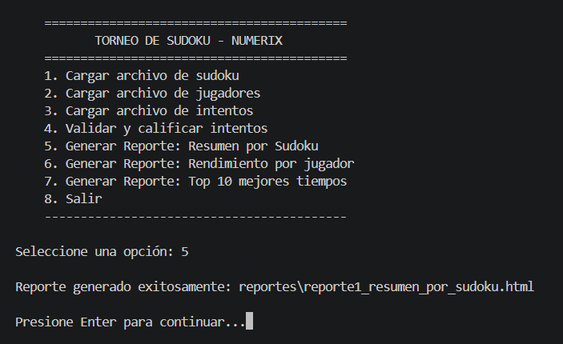
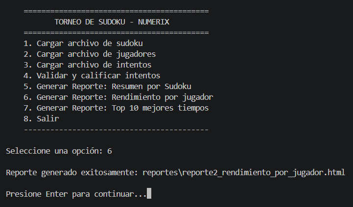
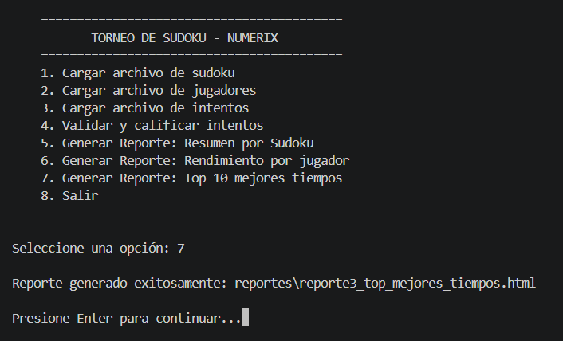
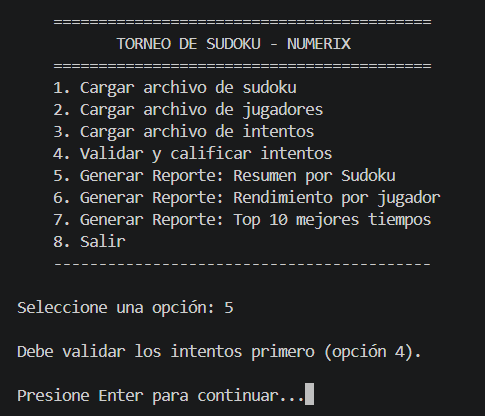

# Manual de Usuario — LFP Numerix
### Torneo de Sudoku: Validación y Análisis de Partidas

**Curso:** Lenguajes Formales y de Programación
**Universidad de San Carlos de Guatemala — Facultad de Ingeniería**
**Autor:** Oliver Jorge Raxtún Morales — Carné 202400634

---

## 1. Introducción

Este manual explica, paso a paso y con lenguaje sencillo, cómo ejecutar
el sistema **LFP Numerix** desde la consola, cargar los archivos del
torneo, calificar los intentos de los jugadores y generar los reportes
analíticos en HTML. Está dirigido a cualquier persona que necesite usar
el programa sin conocer los detalles internos del código (para eso
existe el Manual Técnico).

## 2. Requisitos antes de empezar

- Tener instalado **Python 3.x** en el equipo.
- Contar con los tres archivos de entrada (`sudokus.lfp`, `jugadores.lfp`,
  `intentos.lfp`), ya sea los de ejemplo incluidos en `data/` o propios,
  respetando el formato indicado en la sección 7.
- Abrir una terminal o consola dentro de la carpeta `Practica1`.

## 3. Cómo ejecutar el programa

Desde la terminal, ubicado dentro de la carpeta `Practica1`, ejecutar:

```bash
python3 main.py
```

Si todo está correcto, aparecerá el menú principal:


## 4. Paso a paso: cómo calificar un torneo completo

### Paso 1 — Cargar el archivo de sudokus

En el menú, escribir `1` y presionar Enter. El programa pedirá la ruta
del archivo:

```
Ruta del archivo de sudokus [Enter para usar 'data/sudokus.lfp']:
```

Si se presiona Enter sin escribir nada, se usa el archivo de ejemplo
incluido (`data/sudokus.lfp`). También se puede escribir la ruta de un
archivo propio. El programa confirmará cuántos tableros se cargaron
correctamente:

```
3 registro(s) de sudokus cargado(s) correctamente.
```


### Paso 2 — Cargar el archivo de jugadores

Repetir el proceso con la opción `2`. El programa confirmará cuántos
jugadores se cargaron:

```
4 registro(s) de jugadores cargado(s) correctamente.
```


### Paso 3 — Cargar el archivo de intentos

Repetir el proceso con la opción `3`. El programa confirmará cuántos
intentos se cargaron:

```
8 registro(s) de intentos cargado(s) correctamente.
```


### Paso 4 — Validar y calificar los intentos

Seleccionar la opción `4`. El sistema revisará cada intento cargado
contra su tablero correspondiente (pistas originales, filas, columnas y
cajas de 3x3) y mostrará cuántos fueron validados:

```
8 intento(s) validado(s) correctamente.
```

> **Nota:** esta opción debe ejecutarse *después* de haber cargado los
> sudokus y los intentos (opciones 1 y 3). Si se intenta antes, el
> programa mostrará un mensaje indicando que faltan datos por cargar.


### Paso 5 — Generar los reportes

Con los intentos ya validados, se pueden generar los tres reportes en
cualquier orden:

- **Opción 5** — Reporte 1: Resumen por Sudoku
- **Opción 6** — Reporte 2: Rendimiento por Jugador
- **Opción 7** — Reporte 3: Top 10 Mejores Tiempos

Cada opción muestra la ruta donde se guardó el archivo HTML generado,
por ejemplo:

```
Reporte generado exitosamente: reportes/reporte1_resumen_por_sudoku.html
```







### Paso 6 — Salir del programa

Seleccionar la opción `8` para cerrar el programa de forma ordenada.

## 5. Cómo revisar los reportes generados

Los archivos HTML se guardan en la carpeta `reportes/`, dentro de
`Practica1`. Para verlos, basta con abrirlos con doble clic o
arrastrarlos a cualquier navegador web (Chrome, Firefox, Edge, etc.).

### 5.1 Reporte 1: Resumen por Sudoku

Muestra, para cada tablero del torneo: identificador, dificultad
declarada, cantidad de intentos recibidos, tiempo promedio de
resolución y la tasa de éxito (porcentaje de intentos resueltos al
100%).


### 5.2 Reporte 2: Rendimiento por Jugador

Muestra, para cada jugador: nombre completo, carné, nivel, cantidad de
tableros intentados, porcentaje de validez promedio, tiempo promedio de
resolución y cantidad de tableros resueltos perfectamente.


### 5.3 Reporte 3: Top 10 Mejores Tiempos

Lista, en orden ascendente de tiempo, los 10 mejores intentos resueltos
correctamente (100% de validez), mostrando posición, carné, nombre
completo, identificador del tablero, dificultad y tiempo empleado.


## 6. Casos especiales y mensajes del sistema

| Situación | Qué hace el programa |
|---|---|
| Se selecciona una opción de reporte sin haber validado antes (opción 4) | Muestra el mensaje: *"Debe validar los intentos primero (opción 4)."* |
| Se selecciona la opción 4 sin haber cargado sudokus e intentos | Muestra el mensaje: *"Debe cargar primero los sudokus y los intentos (opciones 1 y 3)."* |
| El archivo indicado no existe | Muestra el mensaje: *"No se encontró el archivo: [ruta]"* |
| Una línea del archivo tiene un formato incorrecto (por ejemplo, le faltan campos o el tablero no tiene 81 caracteres) | Esa línea se omite y se reporta como error en pantalla; el resto del archivo se carga con normalidad |
| Se escribe una opción que no existe en el menú (por ejemplo, `9`) | Muestra el mensaje: *"Opción inválida. Intente nuevamente."* |



## 7. Formato de los archivos de entrada (referencia rápida)

**sudokus.lfp**
```
id_sudoku,dificultad,tablero
1,Facil,530600902000195308008040507859061423020803090010920806960507204287400000345200070
```
- `dificultad` debe ser: `Facil`, `Media`, `Dificil` o `Experto`.
- `tablero` debe tener exactamente 81 dígitos (0 = celda vacía).

**jugadores.lfp**
```
carnet,nombre,apellido,nivel
202011234,Diego,Fuentes,Intermedio
```
- `nivel` debe ser: `Principiante`, `Intermedio` o `Experto`.

**intentos.lfp**
```
carnet,id_sudoku,solucion,tiempo_segundos,fecha
202011234,1,534678912672195348198342567859761423426853791713924856961537284287419635345286179,342,15-03-2026
```
- `solucion` debe tener exactamente 81 dígitos del 1 al 9.
- `fecha` en formato `DD-MM-AAAA`.

---

