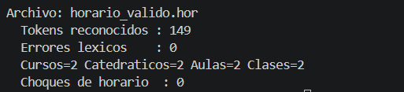
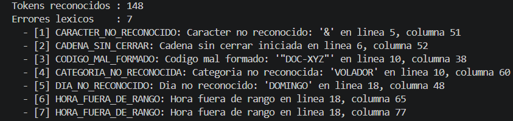
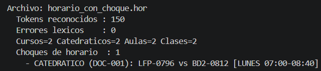
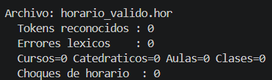
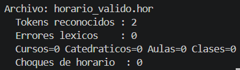

# Casos de Prueba — HorarioScript

Todos los resultados obtenidos que se muestran a continuación fueron
verificados ejecutando realmente `src/analizador_lexico.py`,
`src/interprete.py` y `src/detector_choques.py` sobre cada entrada (ver
`tests/test_manual.py` para un script equivalente). Cada caso incluye un
marcador para la captura de pantalla correspondiente de la interfaz
gráfica; reemplázalo por la imagen real al ejecutar la aplicación.

## Índice de casos

| # | Caso | Archivo de referencia |
|---|---|---|
| 1 | Archivo válido con las 4 secciones | `examples/horario_valido.hor` |
| 2 | Carácter no reconocido | (fragmento inline) |
| 3 | Hora fuera de rango | (fragmento inline) |
| 4 | Día no reconocido | (fragmento inline) |
| 5 | Código mal formado | (fragmento inline) |
| 6 | Cadena sin cerrar | (fragmento inline) |
| 7 | Choques de horario simulados | `examples/horario_con_choque.hor` |
| 8 | Categoría no reconocida (caso extra) | (fragmento inline) |
| 9 | Caso borde: archivo vacío | (fragmento inline) |
| 10 | Caso borde: archivo con solo comentarios | (fragmento inline) |

---

## Caso 1 — Archivo válido con las 4 secciones

**Entrada:** `examples/horario_valido.hor` (2 cursos, 2 catedráticos, 2
aulas, 2 clases, sin choques).

**Resultado esperado:** 0 errores léxicos; el modelo interpretado
contiene 2 cursos, 2 catedráticos, 2 aulas y 2 clases; 0 choques de
horario.

**Resultado obtenido:**

```
tokens=149  errores=0
cursos=2  catedraticos=2  aulas=2  clases=2
choques=0
```

Coincide con lo esperado.

`

---

## Caso 2 — Carácter no reconocido

**Entrada** (fragmento, carácter `&` fuera de comillas y de comentario):

```
HORARIO {
CURSOS {
curso: "Redes" [codigo: "RED-001", creditos: 3] & ,
};
CATEDRATICOS {}; AULAS {}; CLASES {};
};
```

**Resultado esperado:** 1 error de tipo `CARACTER_NO_RECONOCIDO` sobre
el lexema `&`.

**Resultado obtenido:**

```
tokens=33  errores=1
[1] CARACTER_NO_RECONOCIDO: Caracter no reconocido: '&' en linea 3, columna 49 (lexema='&')
```

Coincide con lo esperado.

`

---

## Caso 3 — Hora fuera de rango

**Entrada** (fragmento, clase con horario `23:30`–`23:59`, fuera del
rango institucional 06:00–21:00):

```
CLASES { clase: "AAA-001" con "DOC-001" en "A-1" [dia: LUNES, inicio: 23:30, fin: 23:59, seccion: "N"], };
```

**Resultado esperado:** 2 errores de tipo `HORA_FUERA_DE_RANGO` (uno por
cada literal de hora inválido).

**Resultado obtenido:**

```
tokens=82  errores=2
[1] HORA_FUERA_DE_RANGO: Hora fuera de rango en linea 5, columna 71 (lexema='23:30')
[2] HORA_FUERA_DE_RANGO: Hora fuera de rango en linea 5, columna 83 (lexema='23:59')
```

Coincide con lo esperado.

`

---

## Caso 4 — Día no reconocido

**Entrada** (fragmento, `dia: DOMINGO`, no incluido en el enum válido):

```
CLASES { clase: "AAA-001" con "DOC-001" en "A-1" [dia: DOMINGO, inicio: 07:00, fin: 08:00, seccion: "N"], };
```

**Resultado esperado:** 1 error de tipo `DIA_NO_RECONOCIDO` sobre el
lexema `DOMINGO`; la clase igual se agrega al modelo (el análisis léxico
no detiene la interpretación).

**Resultado obtenido:**

```
tokens=83  errores=1
[1] DIA_NO_RECONOCIDO: Dia no reconocido: 'DOMINGO' en linea 5, columna 56 (lexema='DOMINGO')
cursos=1  catedraticos=1  aulas=1  clases=1
```

Coincide con lo esperado.

`

---

## Caso 5 — Código mal formado

**Entrada** (fragmento, código de catedrático `"DOC-XYZ"`: letras después
del guion en vez de dígitos):

```
CATEDRATICOS {
catedratico: "Doc X" [codigo: "DOC-XYZ", categoria: TITULAR],
};
```

**Resultado esperado:** 1 error de tipo `CODIGO_MAL_FORMADO` sobre el
lexema `"DOC-XYZ"`.

**Resultado obtenido:**

```
tokens=32  errores=1
[1] CODIGO_MAL_FORMADO: Codigo mal formado: '"DOC-XYZ"' en linea 4, columna 31 (lexema='"DOC-XYZ"')
```

Coincide con lo esperado.

`

---

## Caso 6 — Cadena sin cerrar

**Entrada** (fragmento, comilla de apertura sin cierre antes de fin de
línea):

```
curso: "Curso sin cerrar comillas [codigo: "SIN-001", creditos: 3],
```

**Resultado esperado:** 1 error de tipo `CADENA_SIN_CERRAR`, reportado en
la posición de la comilla de apertura, y el análisis continúa con el
resto del archivo sin detenerse.

**Resultado obtenido:**

```
tokens=24  errores=1
[1] CADENA_SIN_CERRAR: Cadena sin cerrar iniciada en linea 3, columna 52 (lexema='", creditos: 3],')
```

Coincide con lo esperado (nota: el enunciado, sección 4.4, menciona este
caso como "comentario sin cerrar"; dado que los comentarios de
HorarioScript no llevan cierre —terminan en `\n`/EOF por definición—, se
interpreta como el caso análogo real del lenguaje: **cadena** sin
cerrar, definido explícitamente en la sección 4.8 del enunciado).

`

---

## Caso 7 — Choques de horario simulados

**Entrada:** `examples/horario_con_choque.hor` (mismo catedrático
`DOC-001`, mismo día `LUNES`, mismo bloque `07:00`–`08:40`, en dos aulas
distintas).

**Resultado esperado:** 0 errores léxicos; 1 choque de tipo
`CATEDRATICO` sobre el recurso `DOC-001`.

**Resultado obtenido:**

```
tokens=150  errores=0
cursos=2  catedraticos=2  aulas=2  clases=2
choques=1
  - CATEDRATICO (DOC-001): LFP-0796 vs BD2-0812 [LUNES 07:00-08:40]
```

Coincide con lo esperado.

`

---

## Caso 8 — Categoría no reconocida (caso extra)

**Entrada** (fragmento, `categoria: VOLADOR`, no incluida en el enum
válido):

```
CATEDRATICOS {
catedratico: "Persona Rara" [codigo: "DOC-XYZ1", categoria: VOLADOR],
};
```

**Resultado esperado:** 2 errores: `CODIGO_MAL_FORMADO` sobre
`"DOC-XYZ1"` (letras tras el guion) y `CATEGORIA_NO_RECONOCIDA` sobre
`VOLADOR`.

**Resultado obtenido:**

```
tokens=31  errores=2
[1] CODIGO_MAL_FORMADO: Codigo mal formado: '"DOC-XYZ1"' en linea 4, columna 38 (lexema='"DOC-XYZ1"')
[2] CATEGORIA_NO_RECONOCIDA: Categoria no reconocida: 'VOLADOR' en linea 4, columna 61 (lexema='VOLADOR')
```

Coincide con lo esperado.

`

---

## Caso 9 — Caso borde: archivo vacío

**Entrada:** archivo `.hor` completamente vacío (0 bytes).

**Resultado esperado:** 0 tokens, 0 errores, modelo vacío (0 cursos, 0
catedráticos, 0 aulas, 0 clases); la aplicación no debe fallar ni lanzar
excepciones.

**Resultado obtenido:**

```
tokens=0  errores=0
cursos=0  catedraticos=0  aulas=0  clases=0
```

Coincide con lo esperado.

`

---

## Caso 10 — Caso borde: archivo con solo comentarios

**Entrada:**

```
## Este archivo solo contiene comentarios
## Segunda linea de comentario con simbolos raros @#$%^&*()
```

**Resultado esperado:** 2 tokens de tipo `COMENTARIO_LINEA`, 0 errores
(los caracteres fuera del alfabeto dentro de un comentario no se
reportan como error, según la regla de la sección 4.5 del enunciado);
modelo vacío.

**Resultado obtenido:**

```
tokens=2  errores=0
cursos=0  catedraticos=0  aulas=0  clases=0
```

Coincide con lo esperado (nótese que la segunda línea contiene `@ # $ %
^ & * ( )`, caracteres normalmente inválidos fuera de un comentario, y
correctamente no generan ningún error por estar dentro de `##...`).

`
