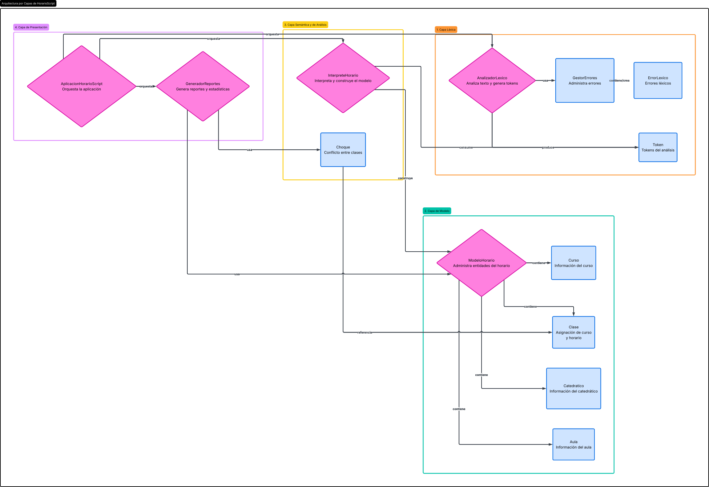
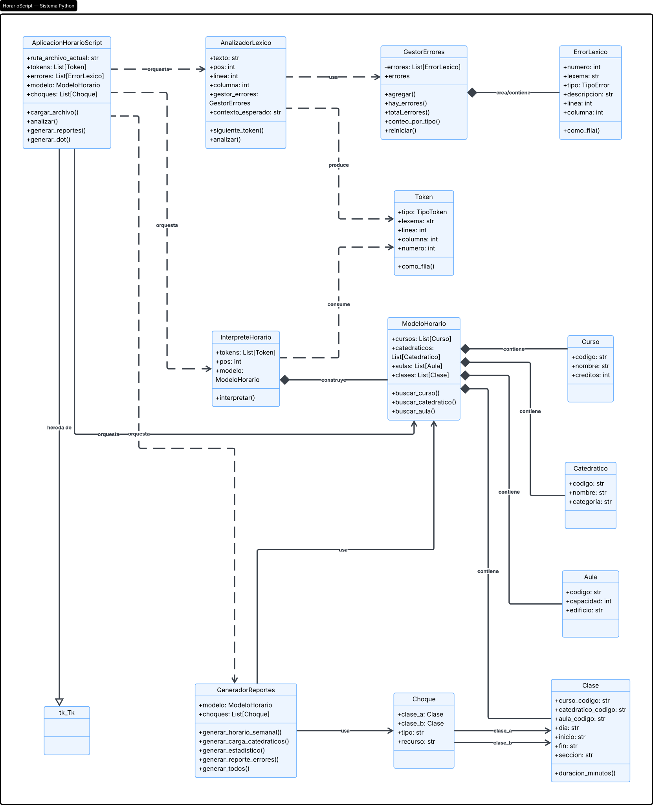
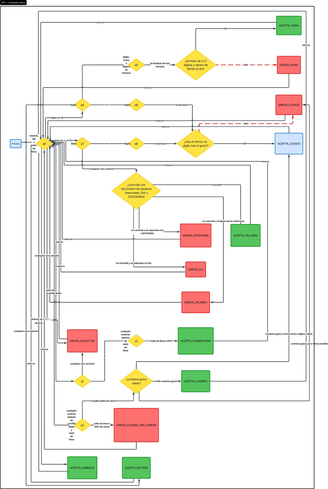

# Manual Técnico — HorarioScript

## Índice

1. [Arquitectura del sistema](#1-arquitectura-del-sistema)
2. [Diagrama de clases](#2-diagrama-de-clases)
3. [Diagrama del AFD](#3-diagrama-del-afd)
4. [Tabla de transiciones](#4-tabla-de-transiciones)
5. [Algoritmo de tokenización](#5-algoritmo-de-tokenización)
6. [Lógica de detección de choques de horario](#6-lógica-de-detección-de-choques-de-horario)
7. [Justificación de decisiones de diseño](#7-justificación-de-decisiones-de-diseño)

---

## 1. Arquitectura del sistema

HorarioScript está organizado en cuatro capas, cada una en su propio
módulo dentro de `src/`, siguiendo el principio de responsabilidad única:

| Capa | Módulo | Responsabilidad |
|---|---|---|
| Léxica | `tokens.py`, `gestor_errores.py`, `analizador_lexico.py` | Convertir el texto crudo del archivo `.hor` en una secuencia de `Token`, acumulando `ErrorLexico` en modo pánico. |
| Semántica | `modelos.py`, `interprete.py` | Convertir la secuencia de tokens en un `ModeloHorario` (objetos `Curso`, `Catedratico`, `Aula`, `Clase`). |
| Análisis derivado | `detector_choques.py`, `generador_dot.py` | Calcular información derivada del modelo: choques de horario y el grafo de relaciones curso-catedrático-aula. |
| Presentación | `generador_reportes.py`, `gui_app.py` | Producir los reportes HTML y la interfaz gráfica que orquesta todo lo anterior. |

Flujo de datos general:

```
archivo.hor
     │
     ▼
AnalizadorLexico.analizar()  ──────►  List[Token]  +  GestorErrores (List[ErrorLexico])
     │
     ▼
InterpreteHorario.interpretar()  ───►  ModeloHorario (cursos, catedraticos, aulas, clases)
     │
     ├──► detectar_choques()  ───────►  List[Choque]
     │
     ├──► guardar_dot()  ─────────────►  jerarquia_horario.dot
     │
     └──► GeneradorReportes.generar_todos()  ──►  4 reportes .html
```

La `AplicacionHorarioScript` (Tkinter) es la única clase que conoce y
coordina las cuatro capas; ninguna capa inferior depende de Tkinter, lo
que permite ejecutar y probar todo el motor desde consola (ver
`tests/test_manual.py`).




---

## 2. Diagrama de clases





---

## 3. Diagrama del AFD




El AFD real está implementado en `src/analizador_lexico.py`. A
continuación se listan los estados que debe contener el diagrama (la
tabla de transiciones formal está en la sección 4).

**Estados:**

- `q0` — estado inicial (y estado de retorno después de aceptar un
  token y de saltar espacios en blanco).
- `q1` — se leyó un `#` (posible comentario).
- `q2` — comentario confirmado (`##`), consumiendo hasta `\n` o EOF.
- `q3` — dentro de una cadena/código entre comillas dobles.
- `q4` — leyendo dígitos (posible ENTERO).
- `q5` — se leyó `:` tras dígitos, leyendo minutos (posible HORA).
- `q6` — se leyó `-` tras dígitos, leyendo dígitos de un CODIGO.
- `q7` — leyendo letras (posible palabra reservada, DIA, CATEGORIA o
  CODIGO).
- `q8` — se leyó `-` tras letras, leyendo dígitos de un CODIGO.
- `qACEPTA_*` — estados de aceptación (doble círculo): `ACEPTA_COMENTARIO`,
  `ACEPTA_CADENA`, `ACEPTA_CODIGO`, `ACEPTA_ENTERO`, `ACEPTA_HORA`,
  `ACEPTA_PALABRA`, `ACEPTA_SIMBOLO`.
- `qERROR_*` — estados de error (doble círculo de otro color):
  `ERROR_CARACTER`, `ERROR_CADENA_SIN_CERRAR`, `ERROR_HORA`,
  `ERROR_CODIGO`, `ERROR_DIA`, `ERROR_CATEGORIA`, `ERROR_PALABRA`.

---

## 4. Tabla de transiciones

| Estado origen | Entrada | Estado destino | Acción semántica |
|---|---|---|---|
| q0 | `#` | q1 | — |
| q0 | `"` | q3 | inicia acumulación del lexema |
| q0 | dígito | q4 | inicia acumulación del lexema |
| q0 | letra | q7 | inicia acumulación del lexema |
| q0 | `{ } [ ] : , ;` | ACEPTA_SIMBOLO | emite `Token(SIMBOLO, c)` |
| q0 | espacio/tab/`\n` | q0 | actualiza línea/columna, no emite token |
| q0 | cualquier otro | ERROR_CARACTER | `GestorErrores.agregar(CARACTER_NO_RECONOCIDO)` |
| q1 | `#` | q2 | — |
| q1 | cualquier otro | ERROR_CARACTER | `GestorErrores.agregar(CARACTER_NO_RECONOCIDO)` sobre el primer `#` |
| q2 | ≠ `\n`, ≠ EOF | q2 (bucle) | acumula lexema del comentario |
| q2 | `\n` / EOF | ACEPTA_COMENTARIO | emite `Token(COMENTARIO_LINEA, lexema)` |
| q3 | ≠ `"`, ≠ `\n` | q3 (bucle) | acumula lexema |
| q3 | `"` | (decisión) | ver regla CODIGO vs CADENA (sección 7) |
| q3 | `\n` / EOF | ERROR_CADENA_SIN_CERRAR | `GestorErrores.agregar(CADENA_SIN_CERRAR)` |
| q4 | dígito | q4 (bucle) | acumula dígitos |
| q4 | `:` | q5 | — |
| q4 | `-` | q6 | — |
| q4 | cualquier otro | ACEPTA_ENTERO | emite `Token(ENTERO, digitos)` |
| q5 | dígito | q5 (bucle, máx. semántico 2) | acumula minutos |
| q5 | cualquier otro | ACEPTA_HORA / ERROR_HORA | valida formato `HH:MM` y rango 06:00–21:00 |
| q6 | dígito | q6 (bucle) | acumula dígitos del código |
| q6 | cualquier otro | ACEPTA_CODIGO / ERROR_CODIGO | valida que existan dígitos tras el guion |
| q7 | letra | q7 (bucle) | acumula letras |
| q7 | `-` | q8 | — |
| q7 | cualquier otro | ACEPTA_PALABRA / ERROR_DIA / ERROR_CATEGORIA / ERROR_PALABRA | clasifica contra diccionarios reservados (sección 5) |
| q8 | dígito | q8 (bucle) | acumula dígitos del código |
| q8 | cualquier otro | ACEPTA_CODIGO / ERROR_CODIGO | valida que existan dígitos tras el guion |

---

## 5. Algoritmo de tokenización

El método público `AnalizadorLexico.siguiente_token()` implementa un
bucle (`while True`) que:

1. Salta espacios en blanco (`_saltar_espacios`), actualizando línea y
   columna carácter a carácter.
2. Si se llegó al final del archivo, retorna `None` (señal de EOF para
   `analizar()`).
3. Examina el carácter actual (sin consumirlo todavía) y decide, según
   su clase (`#`, `"`, dígito, letra, símbolo, u otro), a qué
   subautómata saltar (ver tabla de transiciones).
4. Cada subautómata (`_leer_comentario`, `_leer_cadena` /
   `_clasificar_literal_entre_comillas`, `_leer_numero`, `_leer_palabra`)
   consume caracteres **exclusivamente mediante indexación** (`self.pos`,
   `self.texto[self.pos]`) hasta llegar a un estado de aceptación o de
   error.
5. Si el subautómata reporta un error, el error se registra en
   `GestorErrores` y el bucle **continúa** (no se interrumpe el
   análisis: modo pánico) buscando el siguiente token válido.
6. Si el subautómata acepta un token, este se retorna inmediatamente.

`AnalizadorLexico.analizar()` simplemente llama a `siguiente_token()` en
bucle hasta recibir `None`, numerando cada token en el orden en que
aparece (campo `Token.numero`), lo que garantiza que la tabla de tokens
tenga 100% de precisión en la numeración y en la posición (línea,
columna) de cada lexema.

### Contexto semántico mínimo (`dia` / `categoria`)

El AFD es, en su núcleo, libre de contexto por carácter, pero para poder
emitir `DIA_NO_RECONOCIDO` o `CATEGORIA_NO_RECONOCIDA` en vez de un
genérico `PALABRA_NO_RECONOCIDA`, el analizador recuerda (atributo
`contexto_esperado`) si la última palabra reservada de atributo emitida
fue `dia` o `categoria`. Esta bandera se consulta y se limpia
exactamente al clasificar la siguiente palabra (`_clasificar_palabra`),
por lo que no afecta la naturaleza determinista del AFD: es equivalente
a extender el automata con una variable de estado adicional (técnica
común en analizadores léxicos reales, p. ej. para *lexer states* en
Flex/ANTLR).

---

## 6. Lógica de detección de choques de horario

`detectar_choques(clases)` (en `detector_choques.py`) recibe la lista de
objetos `Clase` ya interpretados y:

1. Genera todas las combinaciones de pares de clases con
   `itertools.combinations` (evita comparar una clase consigo misma y
   evita duplicar pares).
2. Para cada par, `_se_traslapan(clase_a, clase_b)` verifica primero que
   ocurran el **mismo día**; si no, no hay choque posible.
3. Convierte `inicio`/`fin` de ambas clases a minutos desde medianoche
   (`_a_minutos`) y aplica la condición estándar de traslape de
   intervalos: `ini_a < fin_b and ini_b < fin_a`.
4. Si hay traslape, determina el **tipo** de choque comparando
   `catedratico_codigo` y `aula_codigo` de ambas clases:
   - mismo catedrático y misma aula → `AMBOS`
   - solo mismo catedrático → `CATEDRATICO`
   - solo misma aula → `AULA`
   - ninguno de los dos → no se reporta como choque (aunque se
     traslapen, distintos catedráticos en distintas aulas no generan
     conflicto).
5. Cada choque encontrado se agrega como un objeto `Choque(clase_a,
   clase_b, tipo, recurso)`.

Este resultado (`List[Choque]`) es consumido tanto por la GUI (pestaña
"Choques de horario") como por `GeneradorReportes`, que resalta en rojo
las celdas del Reporte 1 correspondientes a clases involucradas en algún
choque.

---

## 7. Justificación de decisiones de diseño

**7.1. Ambigüedad CODIGO vs. CADENA (comillas dobles).** El archivo de
ejemplo del enunciado (sección 4.6) escribe los códigos de curso,
catedrático y aula **entre comillas dobles** (`"LFP-0796"`,
`"DOC-001"`), igual que los nombres en texto libre (`"Otto Rodriguez"`).
Por lo tanto, a nivel puramente léxico ambos comienzan con el mismo
carácter (`"`) y no pueden distinguirse por el primer carácter leído.
La solución adoptada es diferir la clasificación al momento en que se
cierra el literal: se examina el contenido entre comillas y, si contiene
exactamente un guion que separa un prefijo alfanumérico (que inicia con
letra) de un sufijo numérico, se clasifica como `CODIGO`; en caso
contrario, como `CADENA`. Si contiene guion(es) pero no respeta ese
patrón, se reporta `CODIGO_MAL_FORMADO`. Esta es la ambigüedad
explícitamente mencionada en la sección 1.3 del enunciado
("distinguir un código de aula de una hora/cadena").

**7.2. Códigos y palabras sin comillas.** Como medida de robustez
adicional (y para cubrir la regla 4.5 "hora vs. código" tal como está
escrita, que describe dígitos seguidos de `-` como inicio de un
código), el AFD también reconoce el patrón CODIGO cuando aparece **sin**
comillas, tanto si comienza con dígitos (estado q4 → q6) como si
comienza con letras (estado q7 → q8). El archivo de ejemplo del
enunciado no ejercita esta ruta, pero se mantiene por consistencia y
para no rechazar entradas válidas si un archivo futuro no usa comillas.

**7.3. Dos tipos de error adicionales.** La tabla de errores de la
sección 4.8 define 5 tipos. Se agregaron `CATEGORIA_NO_RECONOCIDA`
(simétrico a `DIA_NO_RECONOCIDO`, para cuando el valor de `categoria` no
es `TITULAR`/`INTERINO`/`AUXILIAR`) y `PALABRA_NO_RECONOCIDA` (para
cualquier identificador en minúsculas que no coincida con ninguna
palabra reservada ni atributo conocido, p. ej. un atributo mal escrito).
Ambos son extensiones necesarias para que el AFD sea total (no deje
identificadores sin clasificar) sin forzar un error semánticamente
incorrecto sobre los 5 tipos originales.

**7.4. Palabras de atributo (`codigo`, `dia`, `inicio`, etc.) como
categoría propia.** La tabla de tokens de la sección 4.5 no incluye
explícitamente una categoría para estas palabras clave de atributo, pero
el archivo de ejemplo las usa de forma constante y cerrada (9 palabras
fijas). Se creó el tipo `PALABRA_RESERVADA_ATRIBUTO` para que la
tokenización sea 100% precisa y sin ambigüedad, en vez de forzarlas
dentro de alguna de las categorías existentes.

**7.5. Umbrales de carga de catedrático.** Se usaron los umbrales
sugeridos por el enunciado sin modificación: BAJA (1–4 h), NORMAL (5–10
h), ALTA (11–15 h), SATURADA (16+ h).

**7.6. Ocupación de aula (Reporte 3).** El archivo `.hor` no define una
grilla fija de bloques horarios institucionales (los bloques observados
tienen duraciones distintas: 100 min, 90 min, etc.), por lo que "el
total de bloques disponibles" no es un número fijo conocido de antemano.
Se aproximó como el **total de clases programadas en todo el ciclo**, de
modo que el porcentaje de ocupación de un aula es
`(clases asignadas a esa aula / total de clases) * 100`. Es una métrica
relativa (qué tan concentrada está la programación en un aula respecto
al resto), documentada aquí para que pueda ajustarse si se dispone de un
catálogo fijo de bloques institucionales.

**7.7. Bloques horarios del Reporte 1 (Horario Semanal).** En vez de una
grilla de bloques fijos, las filas de la tabla se generan a partir de los
pares `(inicio, fin)` realmente usados por las clases de cada sección,
ordenados cronológicamente. Esto evita inventar una grilla arbitraria de
bloques que el enunciado no fija explícitamente, y escala igual de bien
si un ciclo usa bloques de 50, 90 o 100 minutos.
