# Manual de Usuario — HorarioScript

Esta guía explica, paso a paso, cómo instalar, ejecutar y usar la
aplicación HorarioScript para analizar archivos `.hor` y generar sus
reportes.


## Índice

1. [Requisitos e instalación](#1-requisitos-e-instalación)
2. [Cómo ejecutar la aplicación](#2-cómo-ejecutar-la-aplicación)
3. [Estructura del archivo .hor](#3-estructura-del-archivo-hor)
4. [Cómo cargar y analizar un archivo](#4-cómo-cargar-y-analizar-un-archivo)
5. [Cómo interpretar la tabla de tokens](#5-cómo-interpretar-la-tabla-de-tokens)
6. [Cómo interpretar el reporte de errores](#6-cómo-interpretar-el-reporte-de-errores)
7. [Cómo revisar los choques de horario](#7-cómo-revisar-los-choques-de-horario)
8. [Cómo generar y navegar los 3 reportes HTML](#8-cómo-generar-y-navegar-los-3-reportes-html)
9. [Cómo generar el diagrama DOT](#9-cómo-generar-el-diagrama-dot)

---

## 1. Requisitos e instalación

- Python 3.10 o superior instalado (incluye Tkinter en la mayoría de
  instalaciones estándar de Windows/macOS; en Linux puede requerir el
  paquete `python3-tk`).
- No se requiere instalar ninguna librería adicional.

```bash
git clone <url-del-repositorio>
cd horarioscript
```

## 2. Cómo ejecutar la aplicación

Desde la carpeta raíz del proyecto, ejecuta:

```bash
python main.py
```

Se abrirá la ventana principal de HorarioScript.

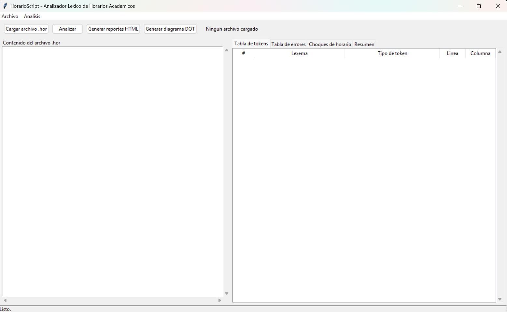

## 3. Estructura del archivo .hor

Un archivo `.hor` describe un único bloque raíz `HORARIO { ... };` con
cuatro secciones obligatorias, en cualquier orden: `CURSOS`,
`CATEDRATICOS`, `AULAS` y `CLASES`. Cada elemento se declara con su
palabra reservada, dos puntos, un nombre entre comillas y una lista de
atributos entre corchetes:

```
curso: "Lenguajes Formales y de Programacion" [codigo: "LFP-0796", creditos: 4],
catedratico: "Otto Rodriguez" [codigo: "DOC-001", categoria: TITULAR],
aula: "A-101" [capacidad: 40, edificio: "T-3"],
clase: "LFP-0796" con "DOC-001" en "A-101" [dia: LUNES, inicio: 07:00, fin: 08:40, seccion: "N"],
```

Los comentarios inician con `##` y ocupan el resto de la línea. Puedes
usar los archivos de la carpeta `examples/` como punto de partida.

## 4. Cómo cargar y analizar un archivo

1. Haz clic en **"Cargar archivo .hor"** (o usa el menú **Archivo →
   Abrir archivo .hor...**).
2. Selecciona un archivo `.hor`, por ejemplo
   `examples/horario_valido.hor`. Su contenido aparecerá en el panel de
   texto de la izquierda.
3. Haz clic en **"Analizar"**. La barra de estado, al pie de la ventana,
   mostrará un resumen (cantidad de tokens, errores, choques y tiempo de
   análisis en milisegundos).

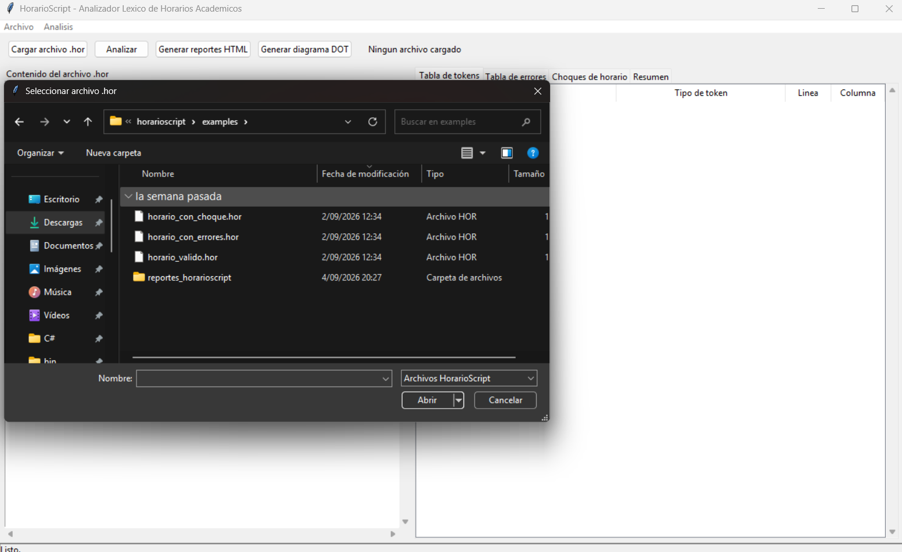

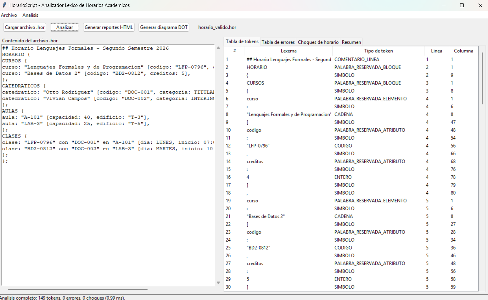

## 5. Cómo interpretar la tabla de tokens

En la pestaña **"Tabla de tokens"** aparece una fila por cada token
reconocido, en el orden en que aparece en el archivo, con las columnas:

| Columna | Significado |
|---|---|
| `#` | Número secuencial del token. |
| `Lexema` | El texto exacto reconocido en el archivo. |
| `Tipo de token` | Una de las 12 categorías (p. ej. `PALABRA_RESERVADA_BLOQUE`, `CODIGO`, `HORA`, `DIA`, `SIMBOLO`, etc.). |
| `Linea` / `Columna` | Posición exacta donde inicia el lexema dentro del archivo. |

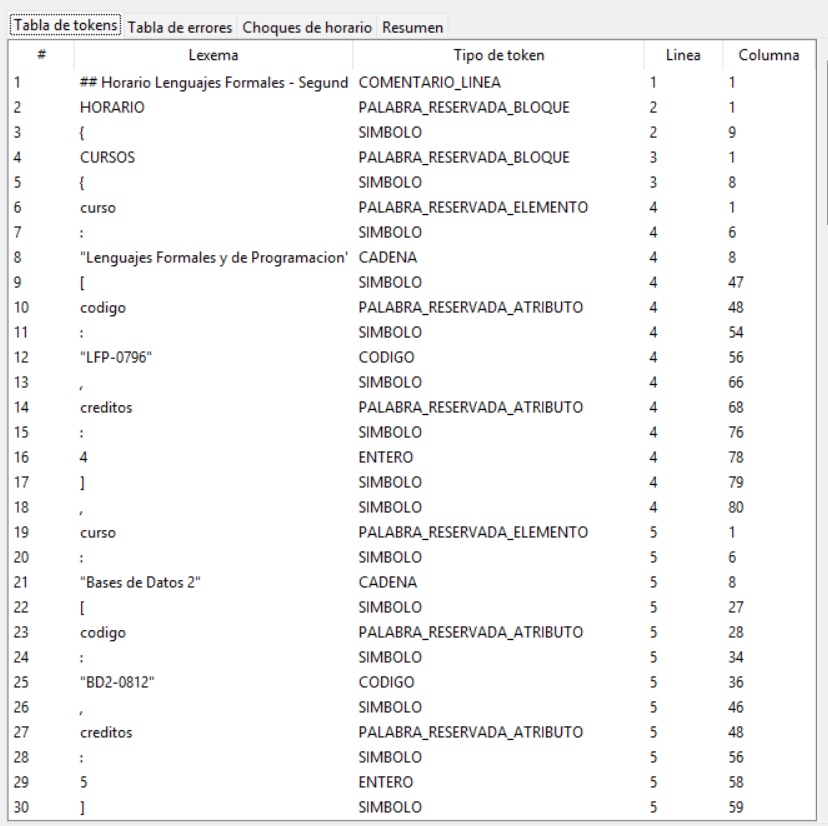

## 6. Cómo interpretar el reporte de errores

En la pestaña **"Tabla de errores"** aparece una fila por cada error
léxico detectado (el análisis nunca se detiene ante el primer error: se
acumulan todos en una sola pasada). Columnas:

| Columna | Significado |
|---|---|
| `#` | Número secuencial del error. |
| `Lexema invalido` | El texto que causó el error. |
| `Tipo de error` | Uno de los 7 tipos reconocidos (ver Manual Técnico, sección 4.8 del enunciado). |
| `Descripcion` | Mensaje explicativo del problema. |
| `Linea` / `Columna` | Posición exacta del error. |

Si cargas `examples/horario_con_errores.hor` y presionas "Analizar",
deberías ver 6 errores: una cadena sin cerrar, un código mal formado,
una categoría no reconocida, un día no reconocido y dos horas fuera de
rango.

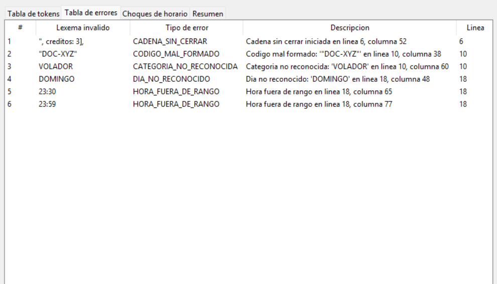

## 7. Cómo revisar los choques de horario

En la pestaña **"Choques de horario"** aparece una fila por cada par de
clases en conflicto (mismo catedrático y/o misma aula, mismo día, bloque
horario traslapado), indicando el tipo de choque (`CATEDRATICO`, `AULA`
o `AMBOS`), el recurso en conflicto y una descripción breve de cada una
de las dos clases involucradas.

Puedes probar esto cargando `examples/horario_con_choque.hor`.

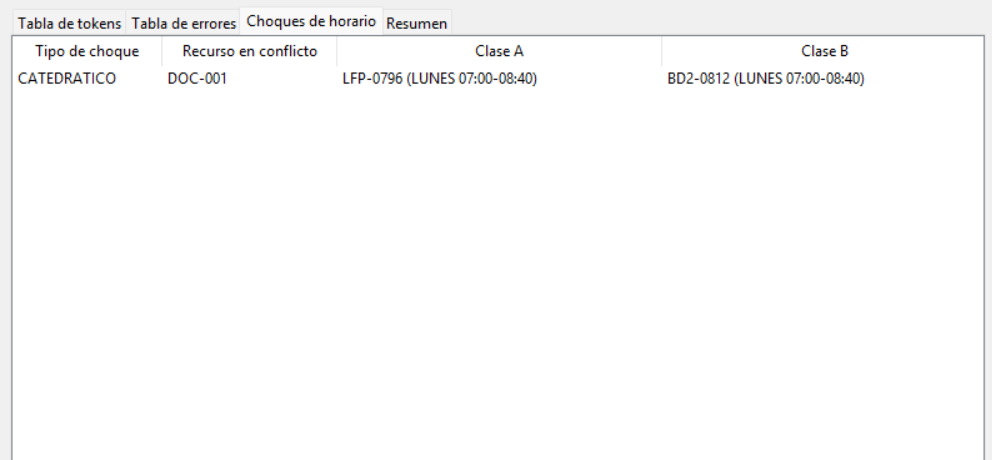

La pestaña **"Resumen"** muestra, además, un conteo global: total de
tokens por tipo, total de errores por tipo, y totales de cursos,
catedráticos, aulas, clases y choques.

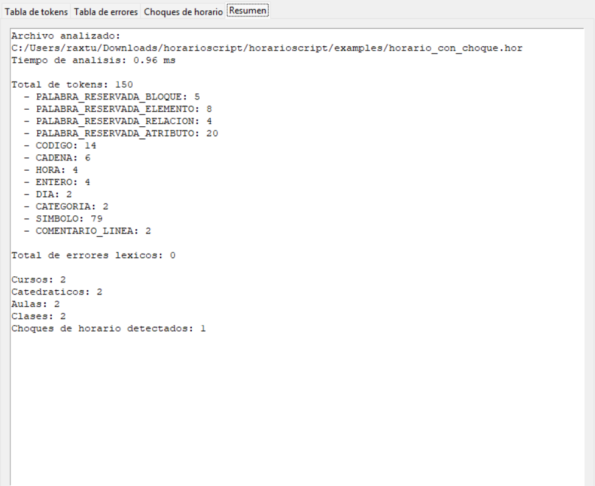

## 8. Cómo generar y navegar los 3 reportes HTML

1. Con un archivo ya analizado, haz clic en **"Generar reportes HTML"**.
2. Se crea una carpeta `reportes_horarioscript/` junto al archivo `.hor`
   analizado, con cuatro archivos:
   - `reporte_horario_semanal.html`
   - `reporte_carga_catedraticos.html`
   - `reporte_estadistico.html`
   - `reporte_errores.html`
3. La aplicación pregunta si deseas abrir automáticamente el reporte de
   horario semanal en tu navegador; puedes también abrir cualquiera de
   los otros tres haciendo doble clic sobre el archivo `.html`
   correspondiente.

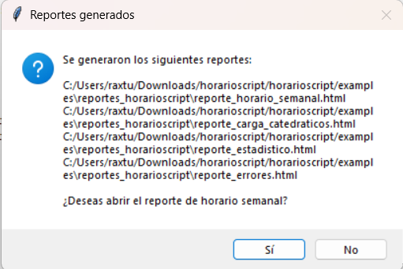

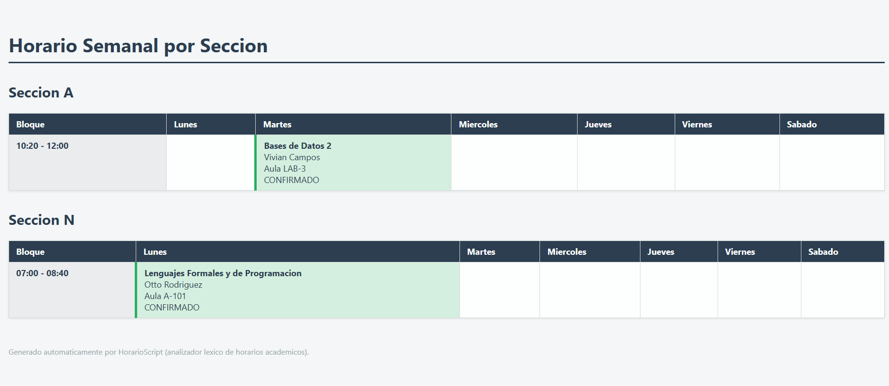

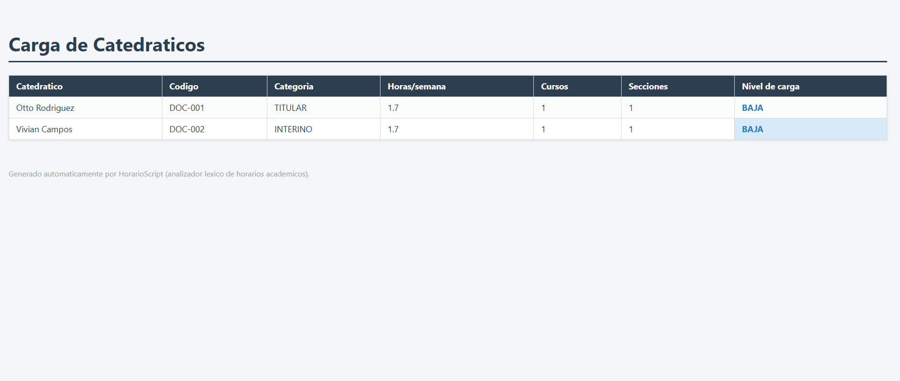

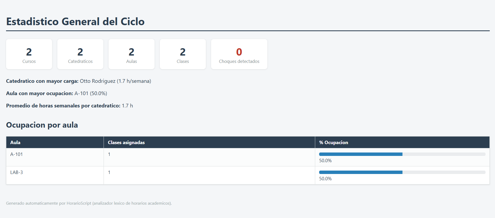

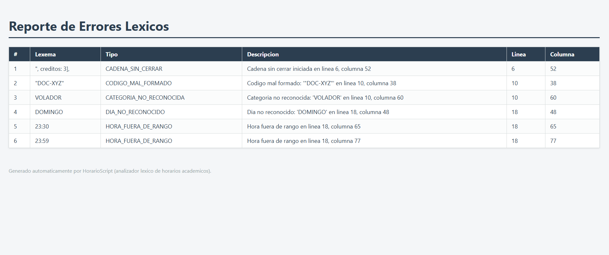

## 9. Cómo generar el diagrama DOT

1. Con un archivo ya analizado, haz clic en **"Generar diagrama DOT"**.
2. Se crea el archivo `jerarquia_horario.dot` dentro de la misma carpeta
   `reportes_horarioscript/`.
3. Para convertirlo en una imagen, instala [Graphviz](https://graphviz.org/download/)
   y ejecuta, desde una terminal:

   ```bash
   dot -Tpng jerarquia_horario.dot -o jerarquia_horario.png
   ```

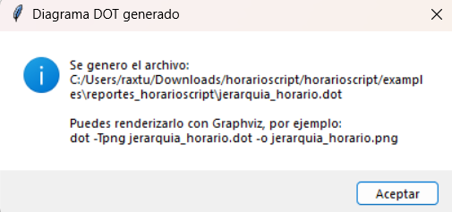

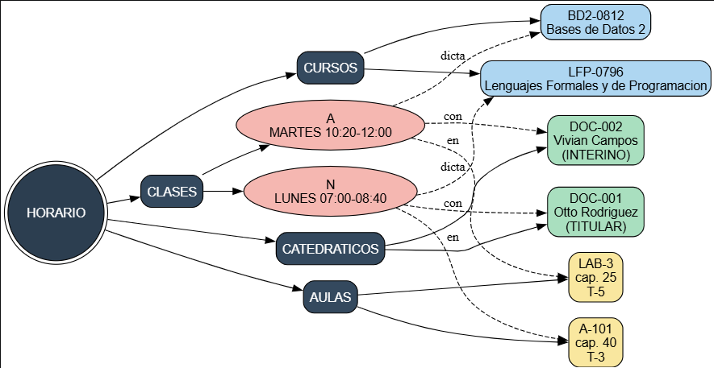
