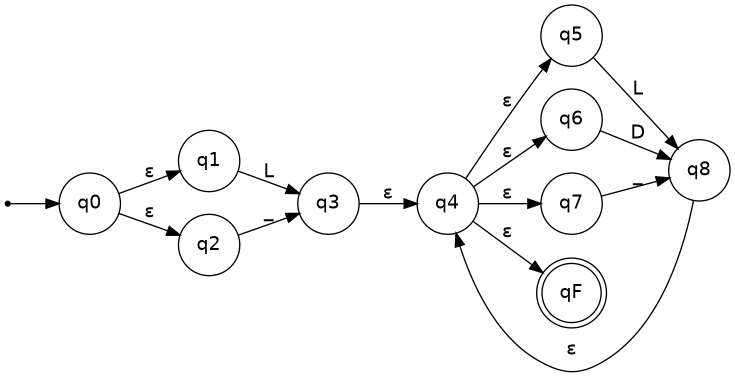
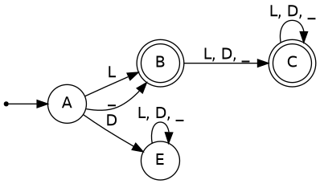

# Tarea #3 — AFN → AFD: reconocimiento de identificadores

**Curso:** Lenguajes Formales y de Programación — Sección A
**Patrón utilizado:** Identificadores
**Autor:** Oliver Jorge Raxtún Morales — carné 202400634

---

## 1. Alfabeto abstracto usado

Para no dibujar una transición por cada letra o dígito individual, se agrupan los símbolos en tres clases:

| Símbolo del autómata | Representa |
|---|---|
| `L` | cualquier letra, `a-z` o `A-Z` |
| `D` | cualquier dígito, `0-9` |
| `_` | el guion bajo literal |

**Regla del lenguaje:** un identificador empieza con una letra o guion bajo, seguido de cero o más letras, dígitos o guiones bajos.

Expresión regular: `(L|_)(L|D|_)*`

---

## 2. Diseño del AFN (AFN-ε, construcción de Thompson)

**Q** = {q0, q1, q2, q3, q4, q5, q6, q7, q8, qF}
**Σ** = {L, D, _}
**q0** = estado inicial
**F** = {qF}

**δ (función de transición):**

| Estado | Símbolo | Estado destino |
|---|---|---|
| q0 | ε | q1 |
| q0 | ε | q2 |
| q1 | L | q3 |
| q2 | _ | q3 |
| q3 | ε | q4 |
| q4 | ε | q5 |
| q4 | ε | q6 |
| q4 | ε | q7 |
| q4 | ε | qF |
| q5 | L | q8 |
| q6 | D | q8 |
| q7 | _ | q8 |
| q8 | ε | q4 |

**Diagrama:**



**Justificación del no determinismo:** el AFN es un AFN-ε (con transiciones vacías). El no determinismo aparece en dos puntos: (1) `q0` tiene dos transiciones-ε posibles (a `q1` y a `q2`), representando la elección entre "empezar con letra" o "empezar con guion bajo"; y (2) `q4` tiene **cuatro** transiciones-ε posibles (a `q5`, `q6`, `q7` o directo a `qF`), que modelan la cerradura de Kleene `(L|D|_)*`: en cada punto el autómata puede "elegir" leer un carácter más o terminar. Al no haber una única transición determinada por el estado actual, se requiere construcción de subconjuntos para eliminarlo.

---

## 3. Construcción de subconjuntos (AFN → AFD)

Se calculan las cerraduras-ε necesarias:

- `ECLOSE(q0) = {q0, q1, q2}`
- `ECLOSE(q3) = {q3, q4, q5, q6, q7, qF}`
- `ECLOSE(q8) = {q8, q4, q5, q6, q7, qF}`

**Desarrollo paso a paso:**

1. **Estado inicial del AFD:** `A = ECLOSE(q0) = {q0, q1, q2}`
2. Desde `A`:
   - con `L`: `q1 --L--> q3` → `ECLOSE(q3) = {q3,q4,q5,q6,q7,qF}` → nuevo estado `B`
   - con `_`: `q2 --_--> q3` → mismo conjunto → `B`
   - con `D`: ninguna transición → estado trampa `E` (no de aceptación)
3. Desde `B = {q3,q4,q5,q6,q7,qF}` (contiene `qF` → estado de aceptación):
   - con `L`: `q5 --L--> q8` → `ECLOSE(q8) = {q8,q4,q5,q6,q7,qF}` → nuevo estado `C`
   - con `D`: `q6 --D--> q8` → mismo conjunto → `C`
   - con `_`: `q7 --_--> q8` → mismo conjunto → `C`
4. Desde `C = {q8,q4,q5,q6,q7,qF}` (contiene `qF` → estado de aceptación):
   - con `L`, `D`, `_`: siempre se llega de nuevo al conjunto `C` (mismo análisis que en `B`, pues comparten `q4,q5,q6,q7,qF`)
5. Desde `E` (estado trampa): con cualquier símbolo permanece en `E`.

No se generan más estados compuestos nuevos: el proceso converge en 4 estados del AFD.

**Tabla de transiciones del AFD** (estados renombrados con letras simples):

| Estado | L | D | _ | ¿Final? |
|---|---|---|---|---|
| **A** (inicial) | B | E | B | No |
| **B** | C | C | C | Sí |
| **C** | C | C | C | Sí |
| **E** (trampa) | E | E | E | No |

**Diagrama del AFD:**



---

## 4. Implementación en código (POO)

Ver archivo `automata.py`. Resumen de la clase:

```python
class Automata:
    def __init__(self):
        self.estados = {"A", "B", "C", "E"}
        self.alfabeto = {"L", "D", "_"}
        self.estado_inicial = "A"
        self.estados_finales = {"B", "C"}
        self.delta = {
            ("A", "L"): "B", ("A", "D"): "E", ("A", "_"): "B",
            ("B", "L"): "C", ("B", "D"): "C", ("B", "_"): "C",
            ("C", "L"): "C", ("C", "D"): "C", ("C", "_"): "C",
            ("E", "L"): "E", ("E", "D"): "E", ("E", "_"): "E",
        }

    def reconoce(self, cadena):
        # recorre la cadena carácter a carácter, clasificándolo en L/D/_
        # y siguiendo delta; devuelve (aceptado, recorrido de estados)
        ...
```

El método `_clasificar(caracter)` traduce cada carácter concreto a su clase (`L`, `D` o `_`); si el carácter no pertenece al alfabeto (por ejemplo `$`), se rechaza de inmediato.

---

## 5. Validación con cadenas de prueba

| Cadena | Esperado | Obtenido | Recorrido de estados |
|---|---|---|---|
| `x` | Aceptada | Aceptada | A → B |
| `_contador` | Aceptada | Aceptada | A → B → C → C → C → C → C → C → C → C |
| `nombre_2` | Aceptada | Aceptada | A → B → C → C → C → C → C → C → C |
| `2variable` | Rechazada | Rechazada | A → E → E → E → E → E → E → E → E → E (empieza con dígito) |
| `precio$` | Rechazada | Rechazada | A → B → C → C → C → C → C → ERROR: `$` no pertenece al alfabeto |

Las 5 cadenas obtuvieron el resultado esperado (3 aceptadas, 2 rechazadas), validando que el AFD implementado coincide con el diseño obtenido por construcción de subconjuntos.
